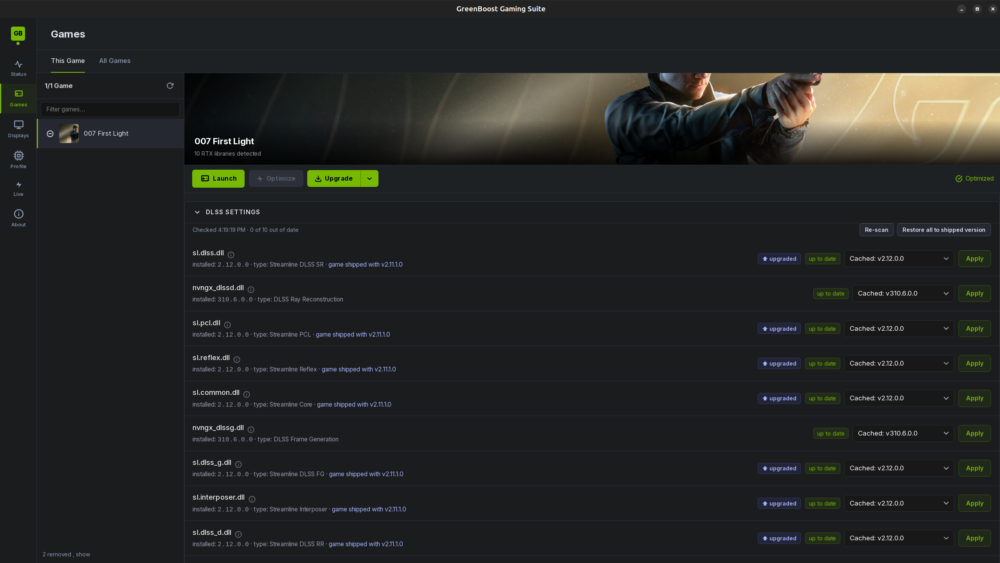
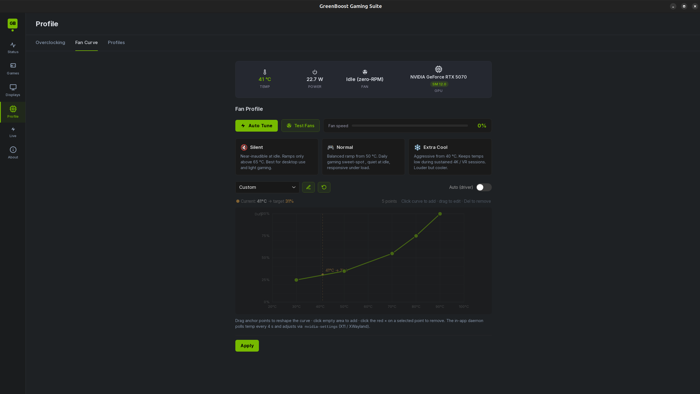
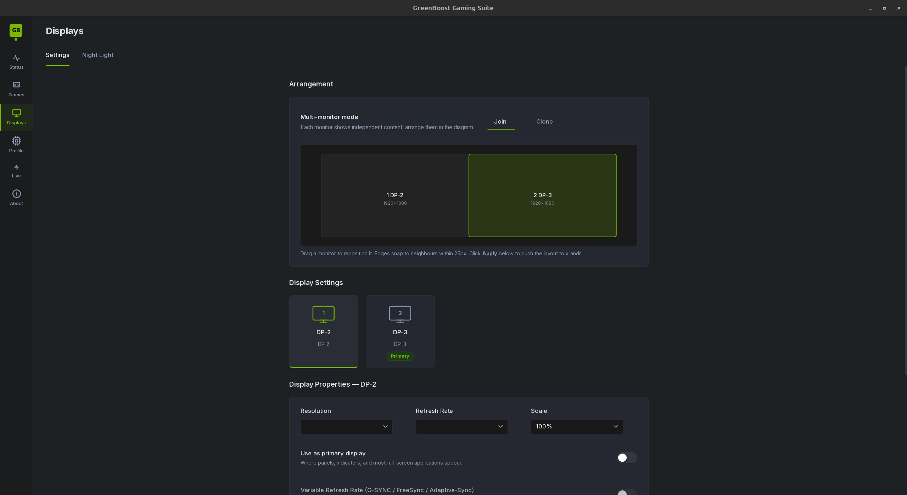
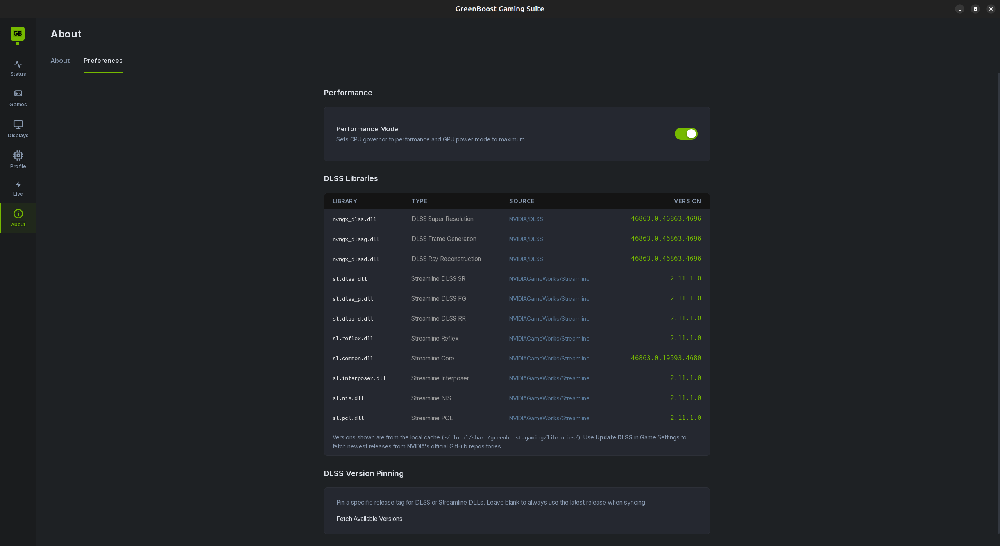

# GreenBoost Gaming Suite

**Status: Alpha / early Beta** , it works on my machine, and that's about as
far as the evidence goes.
**Author:** Ferran Duarri · **License:** GPL v2 (see `LICENSE`)

---

## What this actually is

This is a **side project born from [GreenBoost](https://gitlab.com/IsolatedOctopi/greenboost)**.

GreenBoost is the real project. It's a Linux kernel module plus a CUDA shim
that pools your GPU's VRAM together with system DDR RAM (and NVMe, and even
memory on other machines) into one big tier'd pool, 
apart from offering turboquant, weight quantization, dataflux...

I'm not a gamer.

I don't have a backlog of AAA titles to test against. 
All of this is built and tested on exactly one machine: an RTX 5070 on GNOME/Wayland.

It works there. Beyond there, I genuinely don't know , which is where you come
in (see [Contributing](#contributing), I mean it).

---

**Disclaimer:** GreenBoost & Greenboost Gaming Suite are independent open-source projects and are
not affiliated with, endorsed by, or sponsored by NVIDIA Corporation.
NVIDIA, CUDA, GeForce, and RTX are trademarks of NVIDIA Corporation.

---

## Screenshots

**Games** , Steam library scan, per-title config, and a DLL version picker for
every DLSS/Streamline library the game ships:



**Profile → Fan Curve** , drag the anchor points, watch the current temperature
track along the curve. Live temp/power/fan up top:



**Displays** , multi-monitor arrangement, resolution, refresh rate, scale, VRR:



**About → Preferences** , every DLL in the cache with its version and where it
came from, so you can see the chain of custody at a glance:



---

## So what does it actually do?

Easiest way to answer that is the way I'd answer it across a table, with
a coffee, if you'd just asked me what I've been working on.

**"It gives games more VRAM."** That's the bit that came from the AI
project. Your card has 8, 12, 16 GB, and a modern game eats all of it and
then starts stuttering or quietly loading uglier textures. GreenBoost
lends the game your system RAM as extra memory underneath the real VRAM,
and NVMe after that, and RAM on another machine on your LAN after that.
The game never finds out. It just sees a card with more memory than you
paid for. Slower memory, yes, but memory it can use instead of falling
over.

**"And what if my games run fine already?"** Then you ignore that part
and use the rest, which honestly is what I open it for most days:

- **Your DLSS DLLs are old and nobody tells you.** Games ship whatever
  DLSS version they shipped with, sometimes years out of date. This pulls
  the current ones from NVIDIA's own repos, keeps every version it has
  ever downloaded, and lets you say "this game uses that one". New
  release makes a game shimmer? Roll that one game back. Two clicks.
- **Fans that stop doing the annoying thing.** You drag a curve with the
  mouse and watch your current temperature slide along it. It won't
  oscillate up and down every four seconds, because it waits for a 3 °C
  drop before easing off.
- **Power and clocks in one place**, so you can run the card quieter for
  an evening without going hunting through the terminal.
- **Monitors.** Arrangement, resolution, refresh rate, scaling, VRR. On
  Wayland, natively , not by quietly falling back to X11 behind your back.
- **Per-game settings that stick**, including about 299 profiles already
  written for titles people play, so a lot of the time there's nothing
  for you to configure.
- **A live view while you play** , temperature, clocks, power, VRAM ,
  that warns you the card has started backing off its clocks *before* you
  feel it in the framerate.
- **A status page that just tells you** whether all of this is actually
  running, instead of leaving you to wonder whether it does anything.

**"So who's it for?"** People on an 8 or 12 GB NVIDIA card hitting walls
in AAA titles; people streaming or running an encoder and a language
model alongside the game, where VRAM disappears fast; people who already
run GreenBoost for AI work and would like the same memory pool for the
rest of the machine. And, going by the list above, anyone who just wants
their fan curve, DLSS versions and monitors handled in one window.

None of that second list needs the kernel module. It works with GreenBoost
core doing nothing at all.

---

## What's in the box

| Component | What it does |
|---|---|
| **Vulkan implicit layer** (`greenboost_vulkan_layer.c`) | Inflates each game's reported `VkPhysicalDeviceMemoryProperties` to include T2 DDR, routes overflow allocations through DMA-BUF imports. Also does NIS sharpen/upscale (embedded SPIR-V) and NVIDIA Reflex via `VK_NV_low_latency2` |
| **OpenGL layer** (`greenboost_gl_layer.c`) | The same memory-tiering idea for OpenGL titles. Younger and less exercised than the Vulkan one |
| **Desktop app** | Six views: Status, Games, Displays, Profile, Live, About |
| **GreenBoost Proton** | A Proton version that shows up in Steam's compatibility list next to Proton 10.0 and Experimental, and that you pick per game the same way. It doesn't replace Proton , it sits in front of the one you already have: prepares the machine for that specific title, then hands the launch to upstream Proton (stable or Experimental, selected by a `channel` file) and gets out of the way. Before the hand-off it sets CPU affinity from your real topology, applies the per-game JSON profile's env / DXR / VKD3D settings, activates the GPU power-clock profile and matching fan curve, overlays dxvk-gplasync, stages the NIS shaders, tunes swappiness and the compositor for the session, and writes a telemetry line on exit. If any of that fails it falls back to a plain upstream Proton launch instead of taking the game down with it |
| **Fan daemon** | systemd user unit with a 3 °C hysteresis so your fans stop oscillating |
| **DLSS / Streamline updater** | Pulls the newest DLLs straight from NVIDIA's official GitHub repos, keeps every version it has ever fetched, and lets you pick per game |
| **~299 per-game profiles** | JSON files in `profiles/per-game/` with known-good tweaks per title |

What the views do:

- **Status** , is GreenBoost actually installed and working? Kernel module,
  shim, Vulkan loader, layer registration, with a straight ready / not-ready
  verdict instead of you guessing.
- **Games** , scans your Steam library, per-game overrides, DLSS DLL swapping,
  and a VRAM-risk badge based on what previous sessions of that game actually
  used.
- **Displays** , monitor arrangement, resolution, refresh rate, scaling, VRR,
  night light. Works on Wayland without falling back to X11.
- **Profile** , fan curve editor, power limit, clock locks. Auto Tune reads your
  real CPU/GPU topology instead of guessing.
- **Live** , real-time GPU telemetry, including a thermal-throttle banner that
  fires *before* your framerate tanks rather than after.
- **About** , DLL provenance table, preferences, license, disclaimer.

---

## Before you install: you need GreenBoost core

One of the Suite's features is a **frontend onto the GreenBoost memory pool**.
The kernel module and CUDA shim do the actual memory work , without them you
still get the fan curves, DLSS updater, per-game profiles and display settings,
but not the VRAM expansion.

---

## Install

```bash
git clone https://gitlab.com/IsolatedOctopi/greenboost_gaming_suite.git
cd greenboost_gaming_suite
sudo ./install.sh
```

What that does, in order:

1. Installs the OS packages it needs (only the missing ones).
2. Confirms GreenBoost core is present , and installs it if it isn't.
3. Builds `libVkLayer_greenboost.so` and the NIS SPIR-V shaders if they're
   stale or missing.
4. Installs the Vulkan layer + manifest to `/usr/local/lib/` and
   `/usr/share/vulkan/implicit_layer.d/`.
5. Builds and installs the GUI.
6. Drops the `greenboost-gaming` launcher on PATH and writes a `.desktop`
   entry, so it shows up in the GNOME app grid / KDE / XFCE menus.
7. Runs `greenboost_proton/install.sh` as *you* (not root) to deploy the Steam
   compatibility tool into `~/.local/share/Steam/compatibilitytools.d/`.

Useful variations:

```bash
./install.sh --check                    # dry run , tells you what it would do, changes nothing
sudo ./install.sh --uninstall           # remove everything it installed
```

Then either run `greenboost-gaming` from a terminal, or hit the super key and
type "GreenBoost".

## Contributing

**Contributors are more than welcome.** 

Good places to start, easiest first:

| Where | What |
|---|---|
| `profiles/per-game/` | Add a profile for a game you play. It's one JSON file. Genuinely the most useful thing you can do. |
| Issues | "It broke on my GPU" is a real contribution here. Given I test on one card, I'm flying blind on everything else. |
| `src/src/` | React/TS frontend. Plenty of UI polish left. |
| `gb_gaming/` | Python helpers , fan daemon, NVML control, DLSS updater. |
| `greenboost_vulkan_layer.c` | The deep end. Memory tiering, NIS, Reflex. |
| `greenboost_proton/proton` | The Proton wrapper , launch-time intelligence. |

See [CONTRIBUTING.md](CONTRIBUTING.md) for build instructions and the handful of
rules that actually matter.

---

## Greenboost Gaming Studio references

Logic was ported or adapted from those other projects;

- **[Valve Proton](https://github.com/ValveSoftware/Proton)** , the
  Wine + DXVK + VKD3D stack that runs Windows games on Linux. The
  `greenboost_proton/` wrapper builds on Proton's compatibilitytool
  packaging conventions.
- **[NVIDIA cuda-samples](https://github.com/NVIDIA/cuda-samples)** ,
  reference for external-memory import patterns
  (`cuImportExternalMemory`, OpaqueFd handle type) used by the Vulkan
  layer's T2 overflow path.
- **[vuda](https://github.com/jgbit/vuda)** , Vulkan-as-CUDA shim that
  showed how a Vulkan layer can present CUDA-like memory semantics to
  client applications.
- **[VulkanShaderCUDA](https://github.com/waefrebeorn/VulkanShaderCUDA)** ,
  reference for cross-API memory sharing between Vulkan and CUDA on
  the same physical device.
- **[DLSS-Updater](https://github.com/Recol/DLSS-Updater)** , DLL
  version scanning + patching pattern adapted for the DLSS panel.
- **[GreenWithEnvy](https://gitlab.com/leinardi/gwe)** (GPL v3) ,
  reference for the GPU profile editor (clocks, fan curve, power limit). 
  (actually I have permission for being the successor / official mantainer of GreenWithEnvy)
- **[NVIDIA Image Scaling](https://github.com/NVIDIAGameWorks/NVIDIAImageScaling)** ,
  the NIS shaders the layer compiles to SPIR-V and dispatches at present time.

If you maintain one of these and want the attribution adjusted, open an issue
and I'll fix it.

---

## A note on the DLSS DLLs

You won't find any `.dll` files in this repository, and that's deliberate.
`libraries/` is a **runtime cache** , empty in a fresh clone. The first time you
hit **Update DLSS**, the Suite fetches the Streamline libraries from NVIDIA's
own GitHub repositories, checksums them, and caches them under
`~/.local/share/greenboost-gaming/libraries/`. Every version it fetches is kept,
so you can pin a specific one per game and roll back if a new release regresses.

[DLSS_UPDATER.md](DLSS_UPDATER.md) explains the sources and the chain of custody.

---

## License

GPL v2, open source. Fork it, change it, ship it , just keep the credit.

```
Copyright (C) 2026 Ferran Duarri
```
