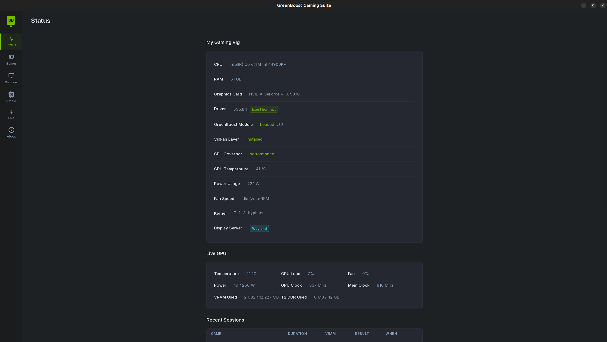
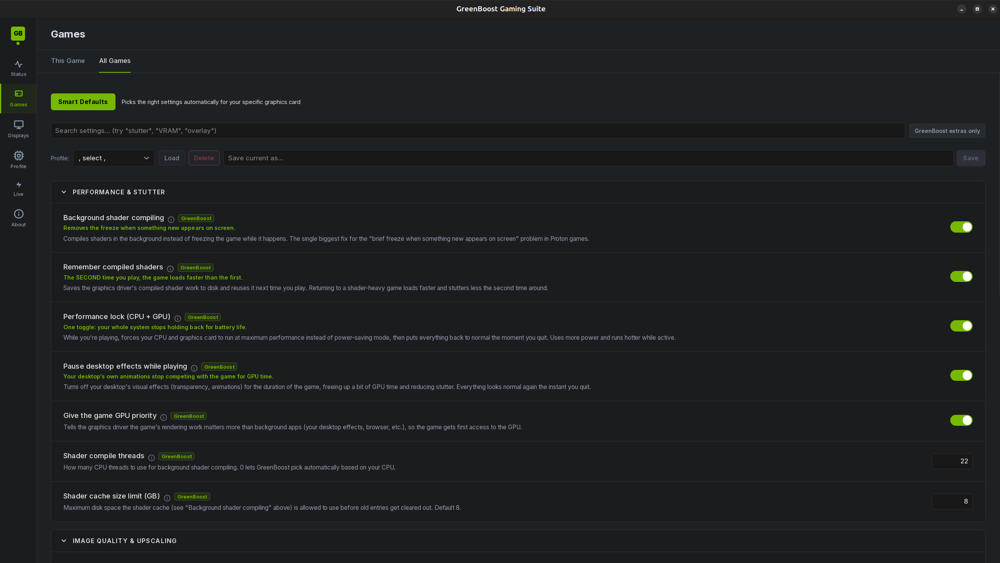
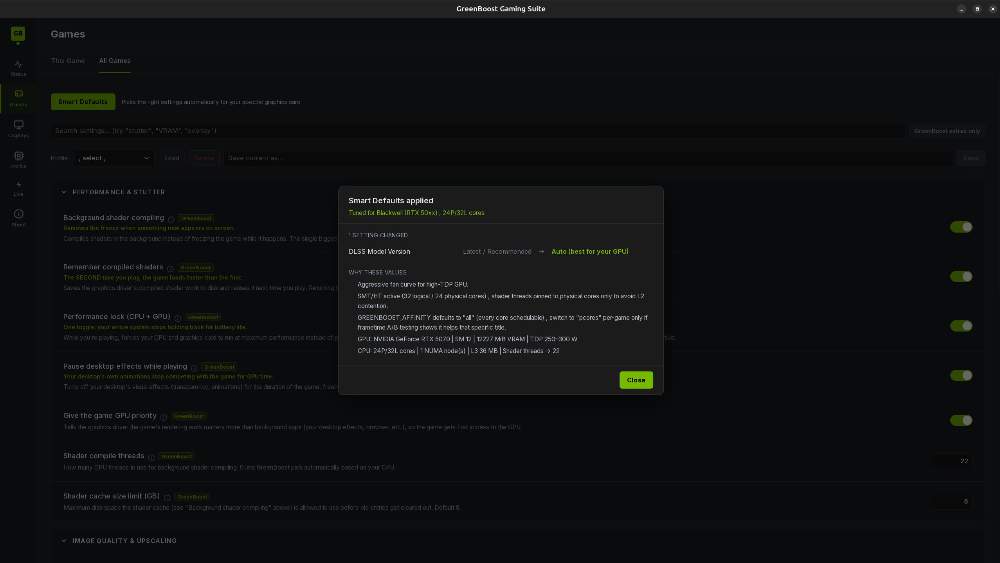
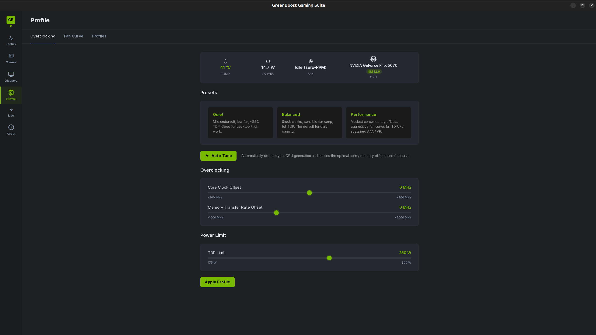
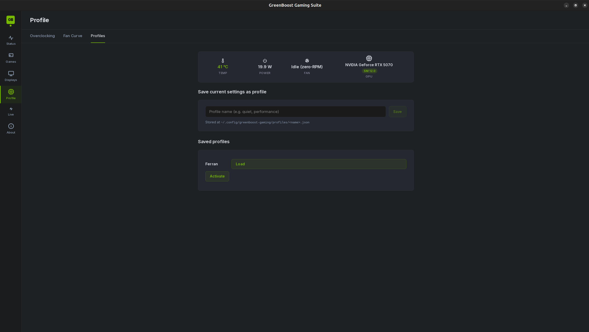
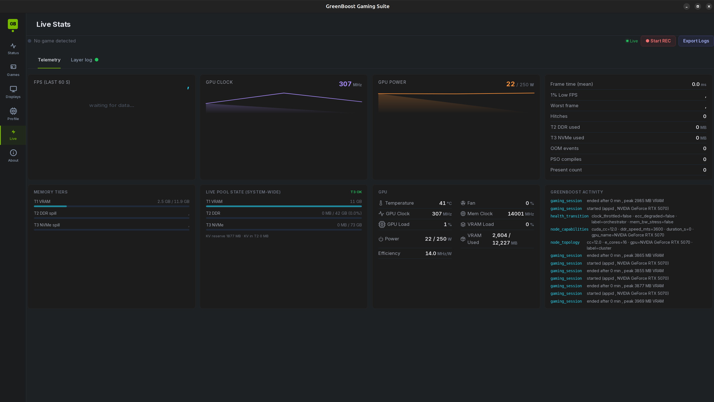

# GreenBoost Gaming Suite

**Status: Alpha / early Beta** , it works on my machine, and that's about as
far as the evidence goes.
**Author:** Ferran Duarri · **License:** GPL v2 (see `LICENSE`)

---

## What this actually is

This is a **side project born from [GreenBoost](https://gitlab.com/IsolatedOctopi/greenboost)**.

GreenBoost is the real project. It's a Linux kernel module plus a CUDA shim
that pools your GPU's VRAM together with system DDR RAM (and NVMe, and even
memory on other machines) into one big tier'd pool, 
apart from offering turboquant, weight quantization, dataflux...

I'm not a gamer.

I don't have a backlog of AAA titles to test against. 
All of this is built and tested on exactly one machine: an RTX 5070 on GNOME/Wayland.

It works there. Beyond there, I genuinely don't know , which is where you come
in (see [Contributing](#contributing), I mean it).

---

**Disclaimer:** GreenBoost & Greenboost Gaming Suite are independent open-source projects and are
not affiliated with, endorsed by, or sponsored by NVIDIA Corporation.
NVIDIA, CUDA, GeForce, and RTX are trademarks of NVIDIA Corporation.

---

## Screenshots

**Status** , what the machine actually is and whether every piece of the stack
came up: driver version, kernel module load state, Vulkan layer, CPU governor,
session type. Live GPU underneath, recent game sessions below that:



**Games → All Games** , the honest list: every setting marked `GreenBoost` is
something Linux + NVIDIA doesn't give you on its own (no NVIDIA App / GeForce
Experience equivalent exists on Linux for most of these). Each row's (i) says
what it actually does, why the gap exists on Linux specifically, and a real
command to verify it yourself , no invented numbers. Search by symptom too
("stutter", "VRAM", "overlay"). All 31 are written up in
[docs/FEATURES.md](docs/FEATURES.md):



**Smart Defaults** , reads your actual CPU/GPU topology and says what it changed
and why, rather than applying a silent preset. Here it detected Blackwell and a
24P/32L-core CPU, and shows the reasoning it used:



**Games → This Game** , Steam library scan, per-title config, and a DLL version
picker for every DLSS/Streamline library the game ships. Each row shows what the
game shipped with, what's installed now, and what's cached to switch to:


**Displays** , multi-monitor arrangement, resolution, refresh rate, scale, and
VRR. Works on a pure Wayland session, no XWayland required:


**Profile → Overclocking** , presets, core/memory offsets and TDP limit. Auto
Tune reads your real GPU generation instead of guessing:



**Profile → Fan Curve** , drag the anchor points, watch the current temperature
track along the curve. The persistent daemon follows whatever you apply here, so
it keeps working after you close the window to play fullscreen:


**Profile → Profiles** , save a full clock/power/fan setup by name and re-activate
it later:



**Live** , real-time telemetry with no game required: GPU clock and power
sparklines, frame-time stats from the Vulkan layer, memory-tier fill, and a
shared timeline of GreenBoost core activity happening on the same GPU:



**About → Preferences** , every DLL in the cache with its version and which
official NVIDIA repository it came from, so the chain of custody is visible at a
glance:


---

## So what does it actually do?

Easiest way to answer that is the way I'd answer it across a table, with
a coffee, if you'd just asked me what I've been working on.

**"It gives games more VRAM."** That's the bit that came from the AI
project, and it's the one I have to be careful about, because it's the
claim everyone wants to be true.

Here's the real shape of it. Your card has 8, 12, 16 GB, and a modern
game eats all of it and then starts stuttering or quietly loading uglier
textures. GreenBoost's memory pool tiers allocations across real VRAM
(T1), system DDR (T2), NVMe (T3), and RAM on another machine on your LAN
after that. That pool is real, it runs, and you can watch it fill from
the Status view.

What it is **not**, today, is a thing that makes an arbitrary game's own
Vulkan or DirectX allocations spill into system RAM. The tiering is real
and active for GreenBoost's own CUDA work , the AI inference this project
was built for , sharing the card with your game. Extending it to
allocations the game itself makes through the NVIDIA driver is an
unsolved problem, and not one I've solved. NVIDIA's Linux Vulkan driver
has no automatic VRAM oversubscription at all: the Windows driver does
it, AMD's Linux driver does something like it, and the NVIDIA Linux
driver just fails the allocation. That gap is industry-wide, and this app
does not currently close it.

So the honest version: if you run a local model alongside your game, this
is the project that lets both of them fit. If you only game, treat this
section as an interesting problem I'm still standing in front of, and use
the rest of the list , which is what I actually open it for.

**"And what if my games run fine already?"** Then you ignore that part
and use the rest, which honestly is what I open it for most days.

There are **31 of those** , 31 things this gives you that a stock Linux +
NVIDIA install doesn't, most of which NVIDIA has never shipped for Linux at
all. Every one is listed, explained, and paired with a way to check it
yourself in **[docs/FEATURES.md](docs/FEATURES.md)**. The same 31 are marked
with a green `GreenBoost` badge inside the app, and **Games → All Games →
GreenBoost extras only** filters the settings list down to exactly them.

The highlights:

- **Your DLSS DLLs are old and nobody tells you.** Games ship whatever
  DLSS version they shipped with, sometimes years out of date. This pulls
  the current ones from NVIDIA's own repos, keeps every version it has
  ever downloaded, and lets you say "this game uses that one". New
  release makes a game shimmer? Roll that one game back. Two clicks.
- **Fans that stop doing the annoying thing.** You drag a curve with the
  mouse and watch your current temperature slide along it. It won't
  oscillate up and down every four seconds, because it waits for a 3 °C
  drop before easing off.
- **Power and clocks in one place**, so you can run the card quieter for
  an evening without going hunting through the terminal.
- **Monitors.** Arrangement, resolution, refresh rate, scaling, VRR. On
  Wayland, natively , not by quietly falling back to X11 behind your back.
- **Per-game settings that stick**, including about 299 profiles already
  written for titles people play, so a lot of the time there's nothing
  for you to configure.
- **A live view while you play** , temperature, clocks, power, VRAM ,
  that warns you the card has started backing off its clocks *before* you
  feel it in the framerate.
- **A status page that just tells you** whether all of this is actually
  running, instead of leaving you to wonder whether it does anything.

**"So who's it for?"** Squarely: people who already run GreenBoost for AI
work and want to game on the same machine without closing everything
first, and people running an encoder or a language model alongside the
game where VRAM disappears fast. Then, going by the list above, anyone on
NVIDIA + Linux who just wants their fan curve, DLSS versions, per-game
settings and monitors handled in one window instead of five terminals ,
which, given NVIDIA has never shipped its control panel for Linux, is
most of us.

None of that second list needs the kernel module. It works with GreenBoost
core doing nothing at all.

---

## What's in the box

| Component | What it does |
|---|---|
| **Vulkan implicit layer** (`greenboost_vulkan_layer.c`) | Inflates each game's reported `VkPhysicalDeviceMemoryProperties` to include T2 DDR, routes overflow allocations through DMA-BUF imports. Also does NIS sharpen/upscale (embedded SPIR-V) and NVIDIA Reflex via `VK_NV_low_latency2` |
| **OpenGL layer** (`greenboost_gl_layer.c`) | The same memory-tiering idea for OpenGL titles. Younger and less exercised than the Vulkan one |
| **Desktop app** | Six views: Status, Games, Displays, Profile, Live, About |
| **GreenBoost Proton** | A Proton version that shows up in Steam's compatibility list next to Proton 10.0 and Experimental, and that you pick per game the same way. It doesn't replace Proton , it sits in front of the one you already have: prepares the machine for that specific title, then hands the launch to upstream Proton (stable or Experimental, selected by a `channel` file) and gets out of the way. Before the hand-off it sets CPU affinity from your real topology, applies the per-game JSON profile's env / DXR / VKD3D settings, activates the GPU power-clock profile and matching fan curve, overlays dxvk-gplasync, stages the NIS shaders, tunes swappiness and the compositor for the session, and writes a telemetry line on exit. If any of that fails it falls back to a plain upstream Proton launch instead of taking the game down with it |
| **Fan daemon** | systemd user unit with a 3 °C hysteresis so your fans stop oscillating |
| **DLSS / Streamline updater** | Pulls the newest DLLs straight from NVIDIA's official GitHub repos, keeps every version it has ever fetched, and lets you pick per game |
| **~299 per-game profiles** | JSON files in `profiles/per-game/` with known-good tweaks per title |

What the views do:

- **Status** , is GreenBoost actually installed and working? Kernel module,
  shim, Vulkan loader, layer registration, with a straight ready / not-ready
  verdict instead of you guessing.
- **Games** , scans your Steam library, per-game overrides, DLSS DLL swapping,
  and a VRAM-risk badge based on what previous sessions of that game actually
  used.
- **Displays** , monitor arrangement, resolution, refresh rate, scaling, VRR,
  night light. Works on Wayland without falling back to X11.
- **Profile** , fan curve editor, power limit, clock locks. Auto Tune reads your
  real CPU/GPU topology instead of guessing.
- **Live** , real-time GPU telemetry, including a throttle banner that names the
  driver's own reason (thermal, power limit, power brake, hardware slowdown) via
  NVML rather than guessing from a temperature reading, and fires *before* your
  framerate tanks rather than after.
- **About** , DLL provenance table, preferences, license, disclaimer.

---

## How this actually plugs into Steam

This is the question I get asked first, so: there is no patching, no
injected DLL of mine, nothing replaced. Two ordinary, documented
extension points do all the work, and I want to be clear that **the
plumbing is boring on purpose , what's novel is what runs once it's
loaded, not how it gets there.**

```
you press Play in Steam
  │
  ▼
~/.local/share/Steam/compatibilitytools.d/greenboost-proton/proton
      a Steam "compatibility tool" , the same mechanism Proton-GE and
      Luxtorpeda use. You pick it per game under Properties →
      Compatibility. Deployed by greenboost_proton/install.sh
  │   detects your GPU and CPU topology, applies that game's JSON
  │   profile, sets GREENBOOST_VULKAN=1 plus ~25 other env vars
  ▼
upstream Proton (stable or Experimental) , inherits that environment
  │   GreenBoost wraps it, never replaces it: if anything above fails,
  │   the launch falls through to a plain Proton run instead of taking
  │   the game down
  ▼
the Vulkan loader reads /usr/share/vulkan/implicit_layer.d/VkLayer_greenboost.json
      an implicit layer manifest, gated on enable_environment:
      GREENBOOST_VULKAN=1 , which is exactly why the wrapper sets it.
      No env var, no layer. Nothing loads into apps you didn't launch
      through it
  │
  ▼
libVkLayer_greenboost.so is now inside the game process
      hooks vkAllocateMemory, vkQueuePresentKHR (that's where NIS
      dispatches), VK_NV_low_latency2 (Reflex), and snapshots the
      pipeline cache
  │
  ▼
ioctl() to greenboost.ko for the memory tiers , optional; without the
kernel module everything else still runs
```

Two details worth knowing because they get assumed wrong:

- **The Vulkan path is not `LD_PRELOAD`.** The Vulkan loader loads the
  layer itself, through the same mechanism MangoHud and the validation
  layers use. The OpenGL path *is* a preload, because OpenGL has no
  equivalent loader concept.
- **The wrapper wraps Proton rather than forking it.** Every Proton fork
  has to be re-forked on each Valve release. This one sets up an
  environment and then hands off, so a Proton update is just a Proton
  update.

---

## What you actually get, and where it comes from

I'd rather sort this honestly than sell it. Everything here falls into
one of three buckets, and only the third is genuinely new.

**Parity work** , Windows has had it for years, usually through NVIDIA
App / GeForce Experience, which has never shipped for Linux. Nothing
clever, it just needed doing:

| Feature | On Windows | NVIDIA ships it on Linux? | What this does |
|---|---|---|---|
| Swap a game's DLSS version | NVIDIA App | No | Fetches from NVIDIA's own GitHub repos, keeps **every** version ever fetched, per-game dropdown |
| Driver update notification | NVIDIA App | No , nothing at all | Status view checks your package manager and says which of three states you're in |
| Fan curve | NVIDIA App / vendor tools | No | Drag-a-curve editor with 3 °C hysteresis so it stops oscillating |
| Power limit + clock locks | NVIDIA App | Partially (`nvidia-smi`, CLI only) | Same window as everything else, via NVML , no X11 needed |
| Performance mode | NVIDIA App | No | CPU governor + GPU clocks + PowerMizer, one toggle, reverted on exit |
| Monitor arrangement / VRR | Windows display settings | No | Wayland-native, no silent X11 fallback |

**Automation of things Linux already had, that nobody wired up.** The
pieces are upstream and community-built; doing it per-game by hand is
what nobody was doing:

| Feature | Who built the underlying piece | What this adds |
|---|---|---|
| Background shader compiling | dxvk-gplasync (community DXVK fork) | Fetches, stages into every game's prefix, keeps updated. One toggle instead of a per-game manual install |
| Persistent pipeline cache | Vulkan's own `VK_EXT_pipeline_cache_control` | Wires it up per-AppID and re-injects on next launch |
| NIS sharpening/upscaling | NVIDIA's own NIS shaders | Dispatches them from the layer, so it works in games whose studio never integrated the SDK |
| Reflex | NVIDIA's `VK_NV_low_latency2` | Same , applied at the layer, independent of game support |
| DirectStorage | vkd3d-proton has shipped it since 2023 | Doesn't reimplement it; tells you whether it's actually engaged for your game, Proton build and disk |

**Genuinely not shipped anywhere, by anyone.** Small list, and I'd rather
it be a small honest list. All of it is experimental and tested on one
machine:

- **Per-file DLSS provenance.** The first time anything touches a DLL,
  the original is snapshotted permanently, so "what did this game
  actually ship with" stays answerable forever. Every other DLSS swapper
  I know of, NVIDIA's included, keeps one most-recent backup , which
  means one wrong swap and the original is gone.
- **Live T1/T2/T3 tier occupancy in the game overlay.** MangoHud has no
  idea GreenBoost's kernel module exists; this wires its `exec=`
  directive to the module's live counters, so you see memory-tier state
  on the same overlay as your FPS.
- **GPU memory tiering itself** , with the scope caveat above. Real for
  GreenBoost's CUDA work sharing your card, not for a game's own
  allocations.

**"Is any of this like DLSS?"** No, and I want to head that off. DLSS is
a neural model NVIDIA trains and ships; nothing here competes with it or
replaces it. What this does is *manage* DLSS , versions, provenance,
presets , and separately adds a memory-tiering idea that has nothing to
do with upscaling. Compatibility with NVIDIA's own tech is by
construction rather than by luck: the layer sits in the loader chain
Khronos documents, and the DLSS work moves NVIDIA's own signed DLLs from
NVIDIA's own repositories. Nothing is patched, reimplemented, or
reverse-engineered.

---

## Before you install: you need GreenBoost core

One of the Suite's features is a **frontend onto the GreenBoost memory pool**.
The kernel module and CUDA shim do the actual memory work , without them you
still get the fan curves, DLSS updater, per-game profiles and display settings,
but not the VRAM expansion.

---

## Install

```bash
git clone https://gitlab.com/IsolatedOctopi/greenboost_gaming_suite.git
cd greenboost_gaming_suite
sudo ./install.sh
```

What that does, in order:

1. Installs the OS packages it needs (only the missing ones).
2. Confirms GreenBoost core is present , and installs it if it isn't.
3. Builds `libVkLayer_greenboost.so` and the NIS SPIR-V shaders if they're
   stale or missing.
4. Installs the Vulkan layer + manifest to `/usr/local/lib/` and
   `/usr/share/vulkan/implicit_layer.d/`.
5. Builds and installs the GUI.
6. Drops the `greenboost-gaming` launcher on PATH and writes a `.desktop`
   entry, so it shows up in the GNOME app grid / KDE / XFCE menus.
7. Runs `greenboost_proton/install.sh` as *you* (not root) to deploy the Steam
   compatibility tool into `~/.local/share/Steam/compatibilitytools.d/`.

Useful variations:

```bash
./install.sh --check                    # dry run , tells you what it would do, changes nothing
sudo ./install.sh --uninstall           # remove everything it installed
```

Then either run `greenboost-gaming` from a terminal, or hit the super key and
type "GreenBoost".

---

## Checking it's actually running, and what's known broken

The Status view answers this for you, and I'd start there. If you want to
confirm it yourself:

```bash
# The Vulkan layer is registered and loads
ls /usr/share/vulkan/implicit_layer.d/VkLayer_greenboost.json
GREENBOOST_VULKAN=1 GREENBOOST_VK_DEBUG=1 vkcube &
journalctl --user --since "5 seconds ago" | grep -i greenboost

# The kernel module is loaded (needed only for the memory tiers)
lsmod | grep greenboost && ls /dev/greenboost

# What the wrapper would set for a given game, without launching it
GREENBOOST_DRY_RUN=1 STEAM_APPID=123456 \
  ~/.local/share/Steam/compatibilitytools.d/greenboost-proton/proton run /bin/true
```

**Known gaps, observed on my machine, not hypothetical.** These fail
quietly by design , the wrapper swallows them so a partial install can't
take your game down , which also means you won't notice unless you look:

- **`gaming_mode` needs you in the `greenboost` group.**
  `/sys/module/greenboost/parameters/gaming_mode` is `root:greenboost 0664`,
  and the installer adds you to that group , but group membership only takes
  effect after you log out and back in. Until it does, the wrapper can't
  raise the flag and the "gaming outranks inference" behavior silently
  no-ops. Check with `id -nG | grep greenboost`.
- **`nvidia-smi` not on PATH inside Steam's sandbox.** Steam Runtime Sniper
  (`pressure-vessel`) doesn't necessarily bind the directory `nvidia-smi`
  lives in into the game's environment. When that happens the pre-flight log
  says so and the GPU half of the performance lock is skipped for that
  session.
- **Layer installed but not found.** If `libVkLayer_greenboost.so` or its
  manifest is missing, NIS and Reflex silently stage but never dispatch.
  This is the single most common cause of "I turned it on and nothing
  happened" , check the first command above.
- **`gb_gaming` not importable from the wrapper.** Then Global Settings
  defaults don't reach the launch. Env vars the wrapper sets directly are
  unaffected, so it degrades partially rather than obviously.
- **Deployed copy drift.** Steam runs the copy in
  `compatibilitytools.d/`, not the one in this repo. `sudo ./install.sh`
  re-deploys it (step 7 above) , if a change doesn't appear at runtime,
  this is almost always why.

The wrapper logs its own pre-flight diagnostics to journald, so
`journalctl --user -n 100 | grep -i greenboost` right after a launch will
tell you which of these you hit.

## Contributing

**Contributors are more than welcome.** 

Good places to start, easiest first:

| Where | What |
|---|---|
| `profiles/per-game/` | Add a profile for a game you play. It's one JSON file. Genuinely the most useful thing you can do. |
| Issues | "It broke on my GPU" is a real contribution here. Given I test on one card, I'm flying blind on everything else. |
| `src/src/` | React/TS frontend. Plenty of UI polish left. |
| `gb_gaming/` | Python helpers , fan daemon, NVML control, DLSS updater. |
| `greenboost_vulkan_layer.c` | The deep end. Memory tiering, NIS, Reflex. |
| `greenboost_proton/proton` | The Proton wrapper , launch-time intelligence. |

See [CONTRIBUTING.md](CONTRIBUTING.md) for build instructions and the handful of
rules that actually matter.

---

## Greenboost Gaming Studio references

Logic was ported or adapted from those other projects;

- **[Valve Proton](https://github.com/ValveSoftware/Proton)** , the
  Wine + DXVK + VKD3D stack that runs Windows games on Linux. The
  `greenboost_proton/` wrapper builds on Proton's compatibilitytool
  packaging conventions.
- **[NVIDIA cuda-samples](https://github.com/NVIDIA/cuda-samples)** ,
  reference for external-memory import patterns
  (`cuImportExternalMemory`, OpaqueFd handle type) used by the Vulkan
  layer's T2 overflow path.
- **[vuda](https://github.com/jgbit/vuda)** , Vulkan-as-CUDA shim that
  showed how a Vulkan layer can present CUDA-like memory semantics to
  client applications.
- **[VulkanShaderCUDA](https://github.com/waefrebeorn/VulkanShaderCUDA)** ,
  reference for cross-API memory sharing between Vulkan and CUDA on
  the same physical device.
- **[DLSS-Updater](https://github.com/Recol/DLSS-Updater)** , DLL
  version scanning + patching pattern adapted for the DLSS panel.
- **[GreenWithEnvy](https://gitlab.com/leinardi/gwe)** (GPL v3) ,
  reference for the GPU profile editor (clocks, fan curve, power limit). 
  (actually I have permission for being the successor / official mantainer of GreenWithEnvy)
- **[NVIDIA Image Scaling](https://github.com/NVIDIAGameWorks/NVIDIAImageScaling)** ,
  the NIS shaders the layer compiles to SPIR-V and dispatches at present time.

If you maintain one of these and want the attribution adjusted, open an issue
and I'll fix it.

---

## A note on the DLSS DLLs

You won't find any `.dll` files in this repository, and that's deliberate.
`libraries/` is a **runtime cache** , empty in a fresh clone. The first time you
hit **Update DLSS**, the Suite fetches the Streamline libraries from NVIDIA's
own GitHub repositories, checksums them, and caches them under
`~/.local/share/greenboost-gaming/libraries/`. Every version it fetches is kept,
so you can pin a specific one per game and roll back if a new release regresses.

[DLSS_UPDATER.md](DLSS_UPDATER.md) explains the sources and the chain of custody.

---

## License

GPL v2, open source. Fork it, change it, ship it , just keep the credit.

```
Copyright (C) 2026 Ferran Duarri
```
